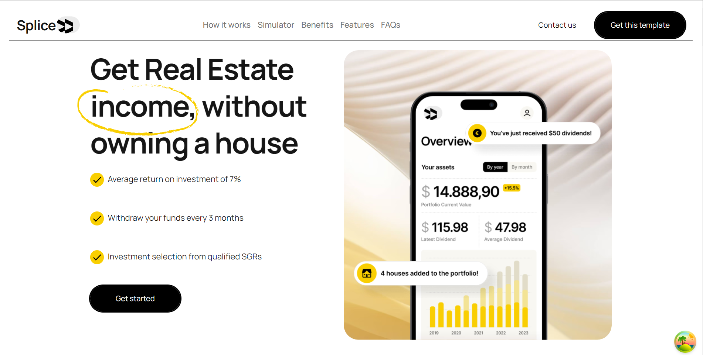

# Slice

## This is a website I built for Fintech Startups to showcase their innovative solutions tailored to meet the evolving needs of their clients.

## Setup & usage

**1. Install all dependencies**

```bash
npm/yarn install
```

**2. Run the development server**

```bash
yarn dev or npm run dev
```

**3. Open [http://localhost:3000](http://localhost:3000) with your browser to see the result.**

---

### Learn More

To learn more about Next.js, take a look at the following resources:

_official policy: it is fOrBiddEn to bring down production with your PRs !!_
